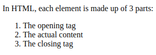
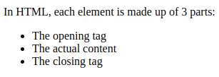

# Lists in HTML

In HTML we can create lists by using the `<ol>` or `<ul>` tags.

If we use the `<ol>` tag, we will obtain an ordered list:



If instead we use the `<ul>` tag, we will obtain an unordered list:



Both of this tags need to have every list item as a child element inside of a `<li>` tag.

In the following code example, the unordered list from the first picture is obtained:

```HTML
    <ul>
      <li>The opening tag</li>
      <li>The actual content</li>
      <li>The closing tag</li>
    </ul>
```
