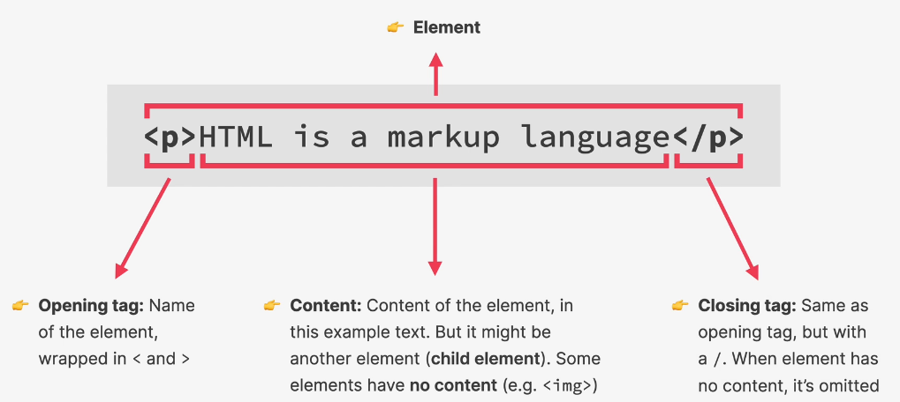

# What is HTML?

HTML, which stands for HyperText Markup Language, is the standard language used to create and design documents on the World Wide Web. HTML is used to structure and describe the content of a web page and, therefore, it's not a programming language.

Web browsers understand HTML and can render HTML files as websites.

HTML fundamental building blocks are called elements. Some examples of HTML elements are paragraphs, links, headings, images and video.

## Anatomy of an HTML element

Every HTML element consists of an opening tag, the actual content and a closing tag.

Some elements have no written content (e.g. images) and therefore they have no closing tag.
